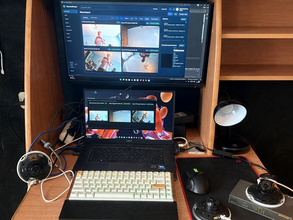
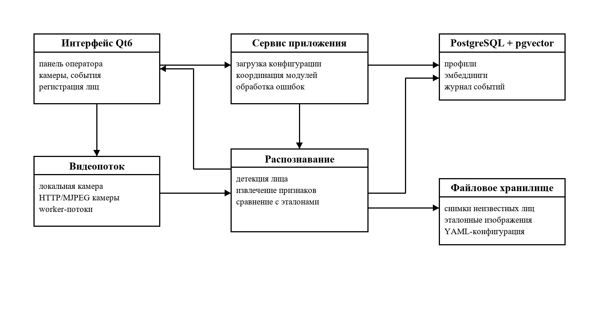
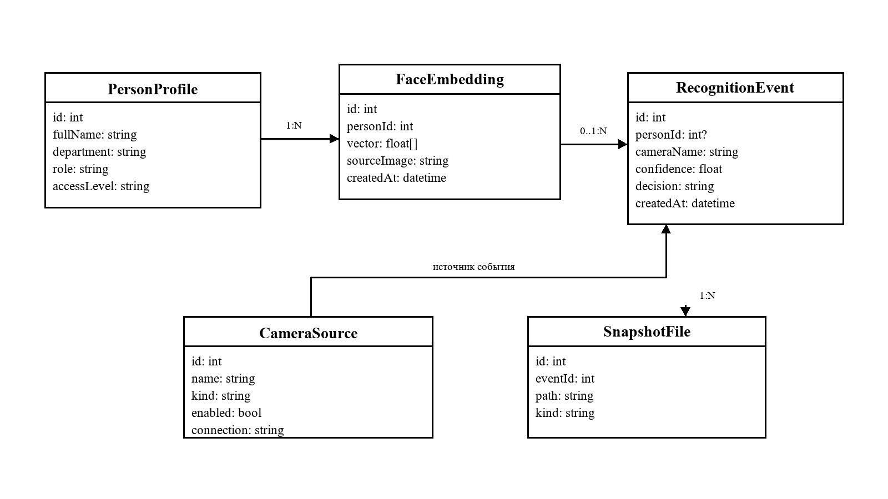
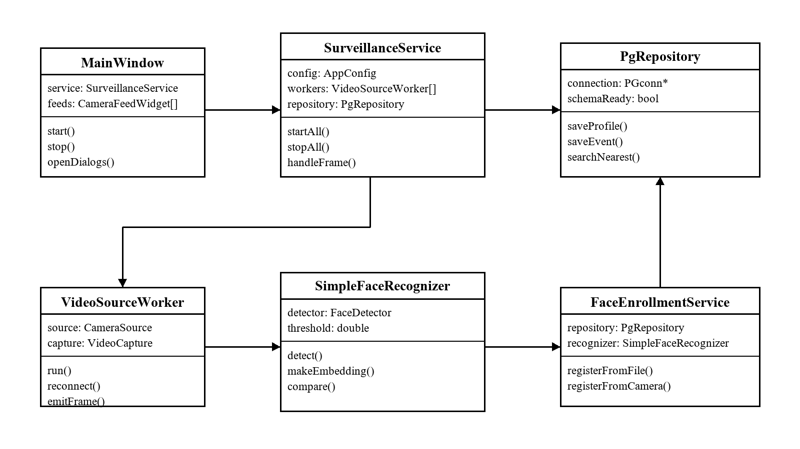
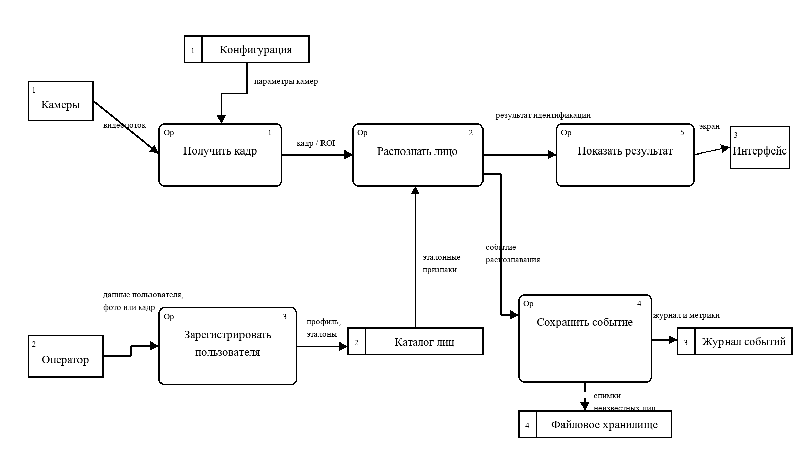
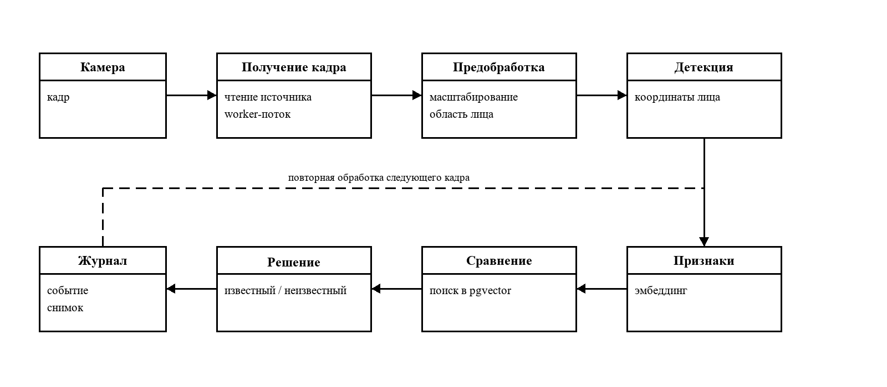
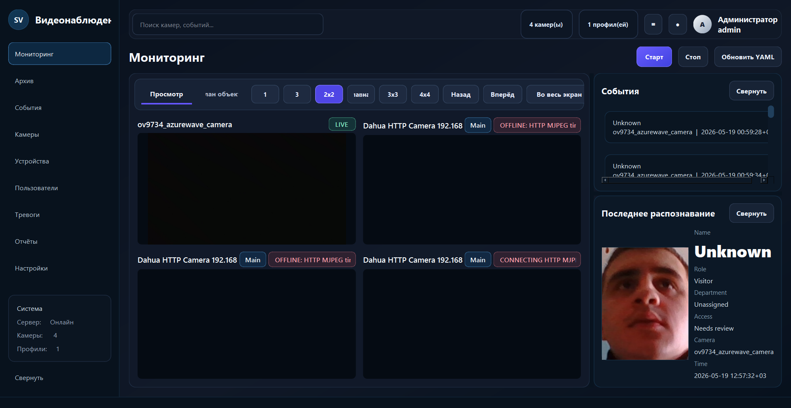
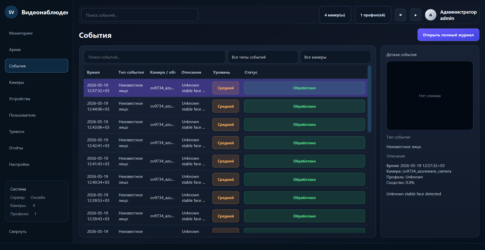
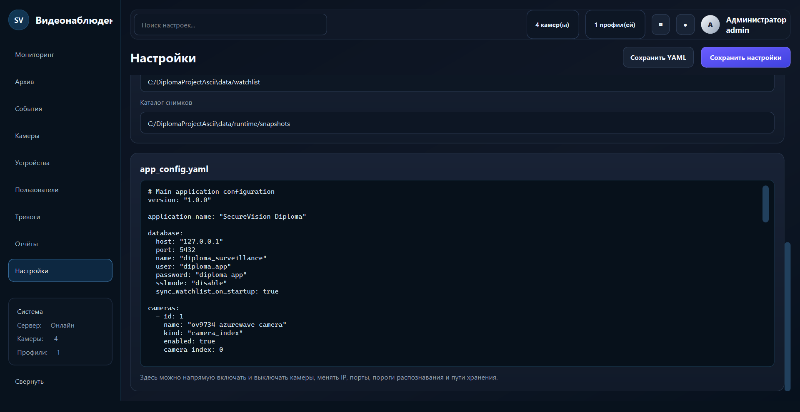

# ВКР: многокамерная система видеонаблюдения с биометрической идентификацией

Репозиторий выпускной квалификационной работы с desktop-прототипом системы видеонаблюдения, который объединяет несколько видеопотоков, выполняет детекцию и распознавание лиц, сохраняет события в PostgreSQL и отображает результаты в интерфейсе на Qt6.

Основной исходный код приложения находится в каталоге [ДИПЛОМНЫЙ ПРОЕКТ](<ДИПЛОМНЫЙ ПРОЕКТ/>).

## Демонстрационный стенд

<p align="center">
  
</p>

На стенде используется ноутбук с приложением оператора, внешний монитор с основным интерфейсом, набор IP/USB-камер и локальная база данных PostgreSQL для хранения профилей и событий.

## Что реализовано

- многокамерный режим обработки видеопотока;
- dashboard оператора на `Qt6 Widgets`;
- распознавание лиц на базе `OpenCV`;
- файловый `watchlist` с синхронизацией профилей в `PostgreSQL + pgvector`;
- журнал событий, снимки и карточка последнего распознавания;
- регистрация пользователя по фото или кадру с камеры;
- конфигурирование через внешний `YAML`;
- архитектура с возможностью замены MVP-распознавателя на `ONNX ArcFace`.

## Технологический стек

- `C++23`
- `CMake`
- `Qt6 Widgets`
- `OpenCV`
- `PostgreSQL`
- `pgvector`
- `YAML`

## Структура репозитория

- [ДИПЛОМНЫЙ ПРОЕКТ](<ДИПЛОМНЫЙ ПРОЕКТ/>) — основной C++/Qt проект, сборка, конфигурация, база данных и исходный код.
- [docs](docs/) — корневые материалы для GitHub: презентация, ассеты для README и краткий каталог документации.
- [BIG_IATE_BR](BIG_IATE_BR/) — дополнительные материалы, не связанные с основной витриной проекта.

## Архитектура решения

Система построена как модульное desktop-приложение. Потоки камер независимо получают кадры, сервис наблюдения координирует обработку, модуль распознавания вычисляет признаки лица и ищет совпадения, а слой хранения сохраняет профили и события. Интерфейс оператора работает поверх этих сервисов и отображает текущее состояние камер, историю событий и карточки распознавания.

### Общая архитектура

<p align="center">
  
</p>

### Модель данных

<p align="center">
  
</p>

### Диаграмма классов

<p align="center">
  
</p>

### Диаграмма потока данных

<p align="center">
  
</p>

### Конвейер обработки

<p align="center">
  
</p>

## Интерфейс оператора

### Экран мониторинга

<p align="center">
  
</p>

### Журнал событий

<p align="center">
  
</p>

### Экран настроек

<p align="center">
  
</p>

## Быстрый запуск

Из корня проекта перейдите в каталог [ДИПЛОМНЫЙ ПРОЕКТ](<ДИПЛОМНЫЙ ПРОЕКТ/>) и используйте один из вариантов запуска:

```powershell
cd ".\ДИПЛОМНЫЙ ПРОЕКТ"
.\scripts\run_demo.ps1 -Configuration Release
```

или:

```bat
cd /d "ДИПЛОМНЫЙ ПРОЕКТ"
START_DEMO.bat
```

Подробности по сборке, зависимостям, PostgreSQL и demo-режиму описаны в [README проекта](<ДИПЛОМНЫЙ ПРОЕКТ/README.md>).

## Документация

- [Каталог материалов](docs/README.md)
- [Актуальная презентация ВКР](docs/presentation/vkr-smirnov-final-2026-06-18.pptx)
- [README основного проекта](<ДИПЛОМНЫЙ ПРОЕКТ/README.md>)
- [Документ по anti-spoofing](<ДИПЛОМНЫЙ ПРОЕКТ/docs/ANTI_SPOOFING.md>)

## Основные модули приложения

- `src/app` — инициализация приложения и безопасный старт.
- `src/core` — доменные модели и конфигурация.
- `src/infrastructure` — загрузка `YAML` и `watchlist`.
- `src/recognition` — детекция лица, антиспуфинг и вычисление признаков.
- `src/video` — worker-потоки видеокамер.
- `src/services` — orchestration, снимки и регистрация профилей.
- `src/storage` — репозиторий `PostgreSQL + pgvector`.
- `src/ui` — dashboard, диалоги и операторский интерфейс.

## Статус проекта

Текущая версия представляет собой дипломно-практичный MVP, пригодный для демонстрации на защите и дальнейшего инженерного развития. Следующий логичный этап расширения — замена текущего распознавателя на нейросетевой `ArcFace/ONNX`, развитие аналитики событий и углубление интеграции с инфраструктурой контроля доступа.
